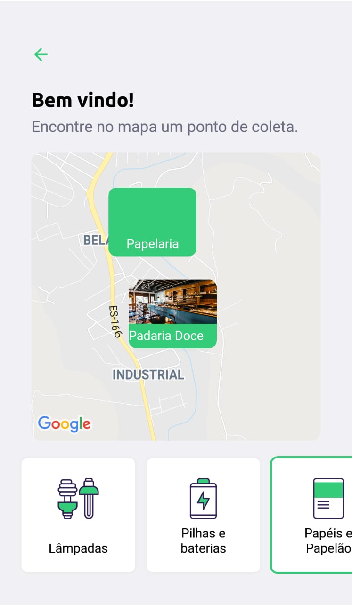

# Ecoleta_NLW

Durante a Next Level Week foi desenvolvido uma aplicação completa com versão WEB e Mobile utilizando as tecnologias ReactJS, ReactNative e Node, além disso foi utilizado o TypeScript em toda a aplicação para que a mesma seja escalável de uma forma mais fácil. A aplicação tem o intuito de cadastrar-se pontos de coleta de resíduos específicos (lâmpadas, pilhas, resíduos organicos, etc.), e o usuário poder pesquisar o ponto de coleta mais proximo de sua casa.

## Interface WEB (Preview, zoom em 50% para poder ver a aplicação melhor)

  

## Interface Mobile (Preview)

  

## Funcionalidades:

- Backend feito em NodeJS que permite a listagem e cadastro de pontos de coleta.
- WEB feito em ReactJS que provêm toda a interface para que o usuário consiga cadastrar o seu ponto de coleta. Possui um formulário com envio de uma foto estabelecimento, e um mapa interativo.
- Mobile feito em ReactNative que provêm ao usuário uma interface onde ele pode filtrar os pontos de coleta que existem na sua cidade e o que cada ponto coleta, alem de entrar em contato enviando uma mensagem por WhatsApp ou um E-mail para o estabelecimento.
